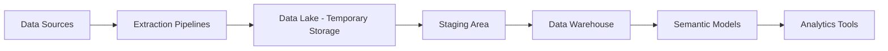

# ⚙️ Scalable Analytical Data Platform

### 🎯 Overview

This project showcases the design and implementation of a **modern analytical data platform** using cloud-native data services.
It demonstrates how to build a **scalable, automated, and governed data ecosystem** for analytics and business intelligence workloads.

The focus is on the **analytical data lifecycle** — from ingestion and transformation to semantic modeling and reporting.

---

### 🧭 Architecture Overview

**Technology Stack (Example):**
Azure Synapse Analytics • Azure Data Factory • Azure Data Lake Storage • Azure SQL Data Warehouse • Power BI • Azure Purview

---

### 🧩 Data Flow Description

| Step  | Component                 | Description                                                                                                                                            |
| ----- | ------------------------- | ------------------------------------------------------------------------------------------------------------------------------------------------------ |
| **1** | **Data Sources**          | Multiple source systems such as ERP, CRM, operational databases, and flat files.                                                                       |
| **2** | **Extraction Layer**      | Parameterized pipelines extract data into a temporary landing zone (data lake) for staging.                                                            |
| **3** | **Staging Area**          | Ingested data is validated, reconciled, and archived for traceability. Only analytical and BI-relevant datasets are retained.                          |
| **4** | **Transformation Layer**  | SQL- and metadata-driven pipelines perform cleaning, mapping, and transformation operations.                                                           |
| **5** | **Data Warehouse**        | Implemented using **Azure Synapse SQL Pools** and structured as a dimensional model (star schema) to support analytical queries and semantic modeling. |
| **6** | **Semantic Models**       | Implemented as **Power BI Semantic Models**, curated and certified to provide governed metrics and business measures.                                  |
| **7** | **Analytics & Reporting** | Reports and dashboards built in BI tools consuming shared semantic models.                                                                             |

---

### 🧠 Automation & Orchestration

The platform is **metadata-driven** and designed for **automation** through layered orchestration:

* **Main Orchestration Pipeline:** Triggers end-to-end data refresh processes.
* **Domain-Level Pipelines:** Manage ingestion per business domain (e.g., sales, operations).
* **Sub-Pipelines:** Handle granular ETL tasks such as reconciliation, validation, and table refreshes.

A **central configuration table** defines:

* Source-to-target mappings
* Scheduling and dependency logic
* Data model definitions (staging and warehouse)

This setup enables **no-code extensibility** — new tables or data sources can be onboarded by configuration only.

---

### 🧰 Key Features

* 🔄 **Reusable pipelines** with parameterized components
* 🧩 **Metadata-driven configuration** for scalability
* 📊 **Dimensional modeling** for analytical performance
* 🔐 **Integrated data governance and lineage**
* 📈 **Certified semantic models** for analytics delivery
* 🧱 **Selective data ingestion** approach — only BI-relevant data retained

---

### 🚀 Benefits

* **Rapid scalability:** Centralized configuration enables new data integrations with minimal effort
* **Improved data quality:** Validation and reconciliation embedded in data flows
* **Lower maintenance:** Reusable and modular pipeline design reduces complexity
* **Governed analytics:** Full data lineage and certification ensure trust in analytical results

---

### 🧩 Example Use Cases

* Consolidating multiple operational systems into a unified analytical model
* Building automated pipelines for periodic data ingestion and model refresh
* Delivering consistent KPI dashboards and semantic data layers for business teams

---

### 🧭 Learnings

* **Metadata-driven architecture** improves maintainability and adaptability
* **Selective staging strategies** balance cost, performance, and accessibility
* **Early integration of governance** ensures long-term scalability and compliance

