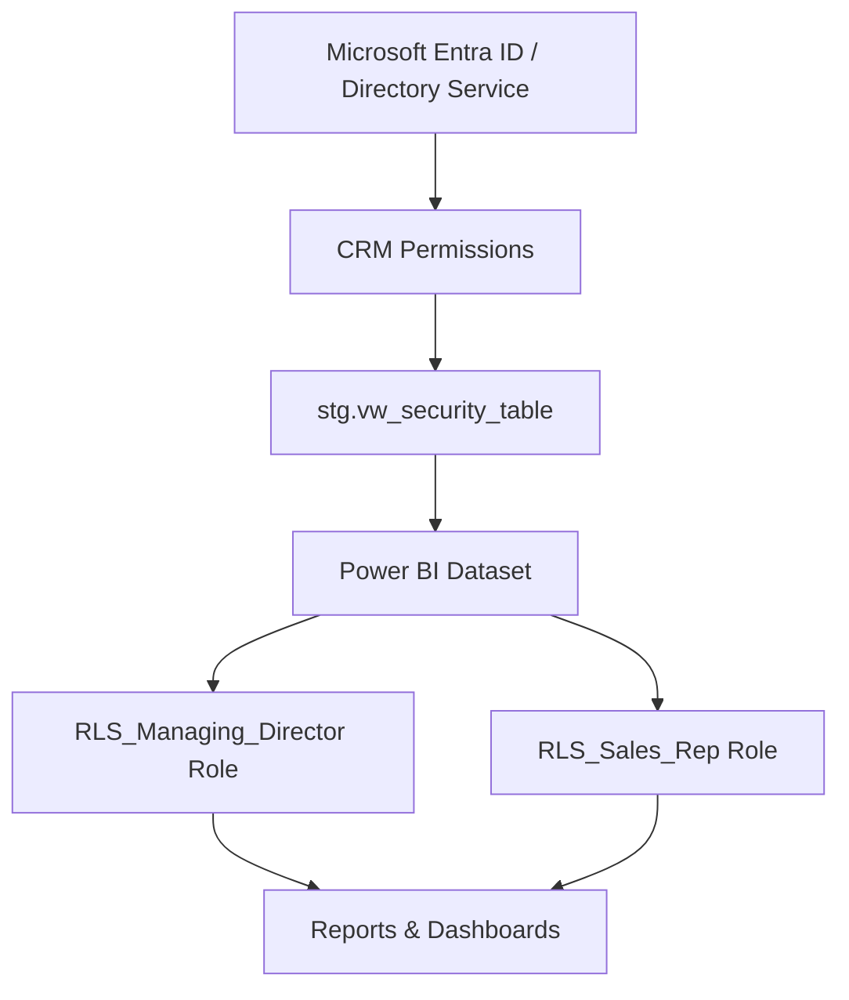

# 🔐 Dynamic Sales Data Security Model

### 🎯 Overview

This project defines a **dynamic row-level security (RLS)** concept for sales analytics in Power BI, ensuring that each user only accesses data relevant to their role or assigned customers.
The approach is part of a broader **data strategy framework**, aligning data governance, architecture, and access management principles within the BI ecosystem.

---

### 🧱 Architecture



---

### 🧩 Core Components

#### **1. Security Table View**

The `vw_security_table` view consolidates user, company, and customer relationships to enable flexible filtering.

Key joins:

* `entra_users` → source of UPN (User Principal Name)
* `crm_legal_entity`, `company_dimension`, `customer_dimension` → link users to business units and customers
* `security_table_exceptions` → supports manual overrides and exceptional access

```sql
CREATE VIEW [stg].[vw_security_table] AS
WITH base_security_table AS (
    SELECT
        LOWER(users.[User Principal Name]) AS email,
        comp.company_id,
        cust.customer_id,
        bu.name AS business_unit,
        COALESCE(users.mod_datetime, SYSDATETIMEOFFSET()) AS stg_mod_datetime,
        SYSDATETIMEOFFSET() AS mod_datetime
    FROM stg.entra_users AS users
    LEFT JOIN stg.crm_legal_entity AS le ON users.[Company] = le.[company_code]
    LEFT JOIN dwh.company_dimension AS comp ON le.[entity_id] = comp.legal_entity_id
    LEFT JOIN dwh.customer_dimension AS cust ON comp.company_id = cust.company_id
    LEFT JOIN dwh.business_unit_dimension AS bu ON bu.entity_id = systemuser.businessunitid
),
filtered_exceptions AS (
    SELECT LOWER(se.email) AS email, se.company_id, se.customer_id, se.business_unit
    FROM dwh.security_table_exceptions AS se
)
SELECT * FROM base_security_table
UNION
SELECT * FROM filtered_exceptions;
```

The **two primary security dimensions** are:

* `customer_id` → filters individual customer access
* `business_unit` → filters data for managing directors

---

#### **2. Power BI Model Requirements**

To activate dynamic RLS:

* Include both **`security_table`** and **`customer_dimension`** in the semantic model.
* Connect `security_table[customer_id]` ↔ `customer_dimension[customer_id]`.
* Define DAX-based role filters.

---

### ⚙️ RLS Role Definitions

#### 🧑‍💼 **RLS_Managing_Director**

Filters data by Business Unit:

```DAX
VAR business_units =
    SELECTCOLUMNS(
        FILTER(
            'security_table',
            'security_table'[email] = USERPRINCIPALNAME()
        ),
        "BU", 'security_table'[business_unit]
    )

RETURN
    COUNTROWS(
        FILTER(
            business_units,
            PATHCONTAINS(customer_dimension[business_unit_path], [BU])
        )
    ) > 0
```

#### 💼 **RLS_Sales_Rep**

Filters data by customer ownership:

```DAX
VAR customer_ids =
    SELECTCOLUMNS(
        FILTER(
            'security_table',
            'security_table'[email] = USERPRINCIPALNAME()
        ),
        "CID", 'security_table'[customer_id]
    )

RETURN
    COUNTROWS(
        FILTER(
            customer_ids,
            customer_dimension[customer_id] = [CID]
        )
    ) > 0
```

---

### 🧠 Key Design Decisions

| Aspect                        | Decision                                  | Rationale                                  |
| ----------------------------- | ----------------------------------------- | ------------------------------------------ |
| **Dynamic Role Binding**      | Link Power BI roles to Entra ID groups    | Simplifies user management                 |
| **Centralized Security View** | One source of truth (`vw_security_table`) | Reduces redundancy and ensures consistency |
| **RLS in Semantic Model**     | Implemented in DAX                        | Enables model-driven, reusable logic       |
| **Auditability**              | `mod_datetime` timestamps                 | Track synchronization and refresh logic    |

---

### 🔍 Governance Considerations

* **Access Policy:** Defined by Entra security groups (`RLS_Managing_Director`, `RLS_Sales_Rep`).
* **Data Lineage:** `stg → dwh → semantic model → Power BI roles`.
* **Monitoring:** Logs of `USERPRINCIPALNAME()` usage and refresh schedules.
* **Data Quality:** Managed through exception tables and sync timestamps.

---

### 🚀 Outcome

This setup delivers:

* Fully **dynamic, role-based security**
* Simplified **maintenance and onboarding**
* Consistent **alignment between operational CRM data and BI access layers**

---

### 🧐 Learnings

* RLS in Power BI scales effectively when backed by **a centralized and well-modeled security layer**.
* Combining directory and CRM relationships supports granular access control.
* Building modular DAX roles allows flexibility across different datasets.

---
